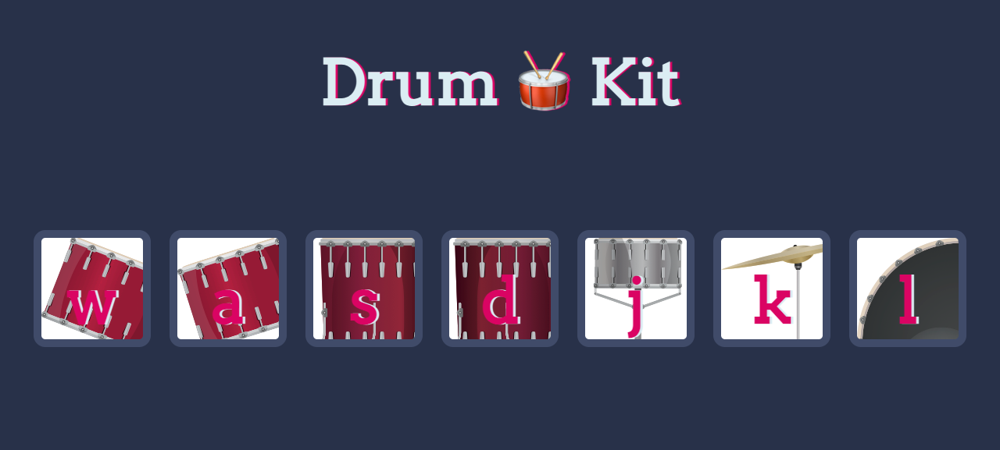

# Drum Kit

A browser drum kit you can play by clicking the pads or pressing the corresponding keyboard keys (w, a, s, d, j, k, l).

## Stack

- HTML5, CSS3, JavaScript (Vanilla)

## Run it

Open `index.html` in a browser.

## Screenshot

## License

MIT — see [LICENSE](LICENSE).
